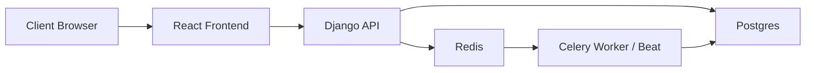

# 00-SYSTEM_OVERVIEW

## What Playto Does
Playto exposes a payout workflow that lets a selected merchant see ledger balance, create a payout to a bank account, and track resulting transactions and payout status changes. The UI shows this explicitly as "Collected in USD · Paid out in INR," while the backend models merchants, bank accounts, payouts, transactions, and idempotency records rather than a generic wallet. Evidence: `frontend/src/App.tsx::App`, `backend/apps/merchants/models.py::Merchant`, `backend/apps/merchants/models.py::BankAccount`, `backend/apps/payouts/models.py::Payout`, `backend/apps/payouts/models.py::Transaction`.

The payout engine exists so money movement is handled in a controlled sequence instead of directly decrementing a balance field. Creation of a payout locks the merchant row, derives spendable balance from ledger rows, inserts a hold transaction, persists the payout in `pending`, and only then enqueues async processing. Evidence: `backend/apps/payouts/services/create_payout.py::CreatePayoutService._run_critical_path`, `backend/apps/payouts/repositories/merchant_repo.py::lock_for_update`, `backend/apps/payouts/repositories/merchant_repo.py::get_balance_breakdown`, `backend/apps/payouts/repositories/payout_repo.py::create_with_hold`.

## Why Float Management Matters
The code does not store an `available_balance` column on `Merchant`; it derives availability from transaction history. That means float is managed through ledger entries rather than mutable snapshots: credit increases funds, hold reserves funds for a payout, release restores reserved funds, and debit finalizes outgoing money. Evidence: `backend/apps/payouts/repositories/merchant_repo.py::get_balance_breakdown`, `backend/apps/payouts/domain/enums.py::TxnType`, `backend/tests/integration/test_worker_success.py::test_success_path`, `backend/tests/integration/test_worker_failure_refund.py::test_failure_atomically_releases`.

Correctness matters here because concurrency and retries are part of the happy path, not edge garnish. The repo has explicit tests for simultaneous payout creation, idempotency replay, in-flight duplicate requests, stale payout recovery, and skip-locked sweeper behavior. Evidence: `backend/tests/integration/test_concurrency_tier1.py::test_concurrency_tier1`, `backend/tests/integration/test_concurrency_tier2.py::test_concurrency_tier2`, `backend/tests/integration/test_idempotency_replay.py::test_idempotency_replay_does_not_double_hold`, `backend/tests/integration/test_idempotency_in_flight.py::test_in_flight_second_request_returns_202_or_stored`, `backend/tests/integration/test_stale_sweeper.py::test_sweeper_skip_locked_no_double_claim`.

## Bounded Contexts
### Merchants
The merchants context owns merchant identity and payout destinations. It exposes merchant listing and active bank-account listing, and `BankAccount` belongs to `Merchant` with an `is_active` flag used during payout creation. Evidence: `backend/apps/merchants/models.py::Merchant`, `backend/apps/merchants/models.py::BankAccount`, `backend/apps/merchants/api/views.py::MerchantListView`, `backend/apps/merchants/api/views.py::BankAccountListView`, `backend/apps/payouts/services/create_payout.py::CreatePayoutService._run_critical_path`.

### Payouts
The payouts context owns request validation, idempotency, ledger reservation, payout lifecycle transitions, async settlement, stale recovery, and reconciliation. It is the codebase core, which also matches Graphify's god nodes where `Payout`, `CreatePayoutService`, `Transaction`, and `ProcessPayoutService` are the most connected abstractions. Evidence: `backend/apps/payouts/api/views.py::PayoutCreateView`, `backend/apps/payouts/services/create_payout.py::CreatePayoutService`, `backend/apps/payouts/services/process_payout.py::ProcessPayoutService`, `backend/apps/payouts/services/retry_stale.py::RetryStalePayoutsService`, `backend/apps/payouts/services/reconcile_ledger.py::ReconcileLedgerService`, `graphify-out/GRAPH_REPORT.md::God Nodes`.

### Observability
Observability is lightweight but intentional: request middleware binds a correlation ID, responses echo it, worker tasks propagate it, and structlog renders JSON logs with contextvars merged in. Evidence: `backend/observability/middleware.py::CorrelationIdMiddleware`, `backend/observability/correlation.py::bind_correlation_id`, `backend/apps/payouts/tasks/payout_tasks.py::process_payout`, `backend/observability/logging.py::configure_logging`, `backend/tests/integration/test_correlation_middleware.py::test_response_echoes_provided_correlation_id`, `backend/tests/integration/test_log_events.py::test_payout_created_log_emitted`.

### Frontend Dashboard
The frontend dashboard is a React + Vite shell around the merchant-selected payout workflow. It loads merchants, stores the selected merchant ID in local storage, polls balances and payouts, fetches transactions on demand, and submits payouts with an autogenerated idempotency key when the caller does not provide one. Evidence: `frontend/src/App.tsx::App`, `frontend/src/hooks/useMerchant.ts::useMerchant`, `frontend/src/hooks/useBalance.ts::useBalance`, `frontend/src/hooks/usePayouts.ts::usePayouts`, `frontend/src/hooks/useTransactions.ts::useTransactions`, `frontend/src/api/client.ts::fetchJson`.

## High-Level Architecture
Playto is composed of:
- Django REST API for sync reads and payout creation. Evidence: `backend/config/urls.py::urlpatterns`, `backend/apps/payouts/api/views.py`, `backend/apps/merchants/api/views.py`.
- PostgreSQL as the source of truth for merchants, bank accounts, payouts, transactions, idempotency records, and payout events. Evidence: `backend/apps/merchants/models.py`, `backend/apps/payouts/models.py`, `backend/config/settings/base.py::DATABASES`.
- Redis as Celery broker and result backend. Evidence: `backend/config/settings/base.py::CELERY_BROKER_URL`, `backend/config/settings/base.py::CELERY_RESULT_BACKEND`, `docker-compose.yml::redis`.
- Celery worker and beat for payout processing, stale sweep, and idempotency expiry. Evidence: `backend/apps/payouts/tasks/payout_tasks.py::process_payout`, `backend/apps/payouts/tasks/sweep_stale.py::sweep_stale`, `backend/apps/payouts/tasks/expire_idempotency.py::expire_idempotency`, `backend/config/settings/base.py::CELERY_BEAT_SCHEDULE`, `docker-compose.yml::worker`, `docker-compose.yml::beat`.
- React + TypeScript frontend for operator workflows. Evidence: `frontend/package.json`, `frontend/src/App.tsx::App`, `frontend/src/api/types.ts`.
- Docker Compose local runtime tying the whole stack together. Evidence: `docker-compose.yml`, `backend/Dockerfile`, `frontend/Dockerfile`.

## Why This Shape Exists
The system splits sync and async concerns on purpose. Synchronous API work stops at "reserve funds and create payout"; settlement happens later through Celery, which keeps request latency bounded and allows recovery flows like stale sweep and idempotency expiry to exist independently. Evidence: `backend/apps/payouts/services/create_payout.py::CreatePayoutService._run_critical_path`, `backend/apps/payouts/tasks/payout_tasks.py::process_payout`, `backend/apps/payouts/tasks/sweep_stale.py::sweep_stale`, `backend/config/settings/base.py::CELERY_BEAT_SCHEDULE`.

The repo also favors database-enforced correctness over application optimism. Unique idempotency keys, check constraints on transaction shape, conditional status transitions, and row locks are all there to make invalid states harder to express. Evidence: `backend/apps/payouts/models.py::IdempotencyRecord.Meta`, `backend/apps/payouts/models.py::Transaction.Meta`, `backend/apps/payouts/repositories/payout_repo.py::transition`, `backend/apps/payouts/repositories/merchant_repo.py::lock_for_update`, `backend/tests/integration/test_db_constraints.py::test_idempotency_unique_key_constraint`.

## Glossary
- `hold`: A ledger transaction that reserves payout funds before external settlement. Evidence: `backend/apps/payouts/repositories/transaction_repo.py::insert_hold`, `backend/apps/payouts/repositories/payout_repo.py::create_with_hold`.
- `debit`: A ledger transaction that finalizes money leaving the merchant after successful settlement. Evidence: `backend/apps/payouts/repositories/transaction_repo.py::insert_debit`, `backend/apps/payouts/services/process_payout.py::ProcessPayoutService.execute`.
- `release`: A ledger transaction that restores previously held funds after payout failure or terminal stale exhaustion. Evidence: `backend/apps/payouts/repositories/transaction_repo.py::insert_release`, `backend/apps/payouts/services/process_payout.py::ProcessPayoutService.execute`, `backend/apps/payouts/services/retry_stale.py::RetryStalePayoutsService._handle_stale`.
- `stale payout`: A payout stuck in `processing` with `last_attempted_at` older than the configured threshold, eligible for sweeper reclaim using `FOR UPDATE SKIP LOCKED`. Evidence: `backend/apps/payouts/repositories/payout_repo.py::claim_stale_with_skip_locked`, `backend/apps/payouts/services/retry_stale.py::RetryStalePayoutsService.execute`.
- `idempotency`: Request deduplication keyed by `(merchant, idempotency_key)` plus a canonical request-body hash and stored response body. Evidence: `backend/apps/payouts/models.py::IdempotencyRecord`, `backend/apps/payouts/repositories/idempotency_repo.py::insert_or_get_by_key`, `backend/apps/payouts/services/create_payout.py::CreatePayoutService._handle_existing_record`.
- `ledger`: The append-only set of `Transaction` rows used to derive available and held balances instead of storing mutable balances on merchants. Evidence: `backend/apps/payouts/models.py::Transaction`, `backend/apps/payouts/repositories/merchant_repo.py::get_balance_breakdown`.
- `correlation_id`: A trace identifier bound at request entry or task execution and echoed in HTTP responses and logs. Evidence: `backend/observability/middleware.py::CorrelationIdMiddleware`, `backend/observability/correlation.py::get_correlation_id`, `backend/apps/payouts/tasks/payout_tasks.py::process_payout`.

## Known Unknowns
- The docs prompt frames the product as a creator-monetization system, but the runtime code only models merchants and payouts. Treat "creator monetization" as inferred context rather than a proven domain object. Evidence: `docs/prompt.md`, `backend/apps/merchants/models.py::Merchant`. Confidence: Low.
- The UI says "Collected in USD · Paid out in INR," but there is no FX conversion, rate service, or settlement adapter in the repo. The statement appears to be business framing, not implemented conversion logic. Evidence: `frontend/src/App.tsx::App`. Confidence: Medium.
- The backend uses `simulate_bank_settlement()` rather than a real banking integration, so operational assumptions about actual bank acknowledgements, callbacks, or transfer rails are not represented in code. Evidence: `backend/apps/payouts/services/process_payout.py::simulate_bank_settlement`. Confidence: High.
- No production topology beyond the Compose stack is present in repo, so HA assumptions such as multiple API instances, autoscaling workers, or managed Redis/Postgres settings should not be inferred from these docs. Evidence: `docker-compose.yml`, absence of IaC or deployment manifests. Confidence: Medium.
