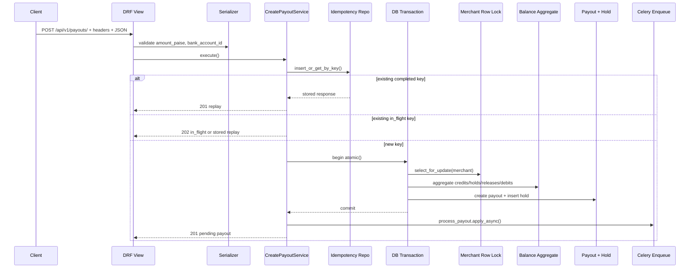
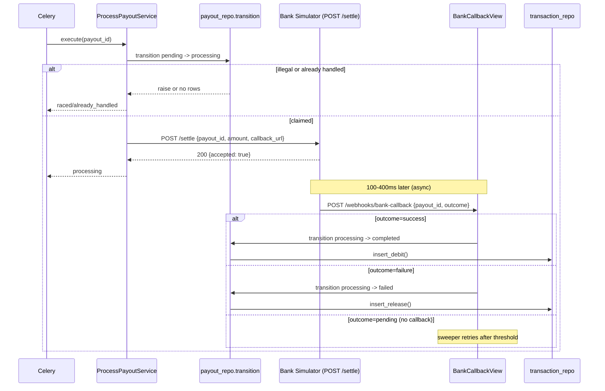
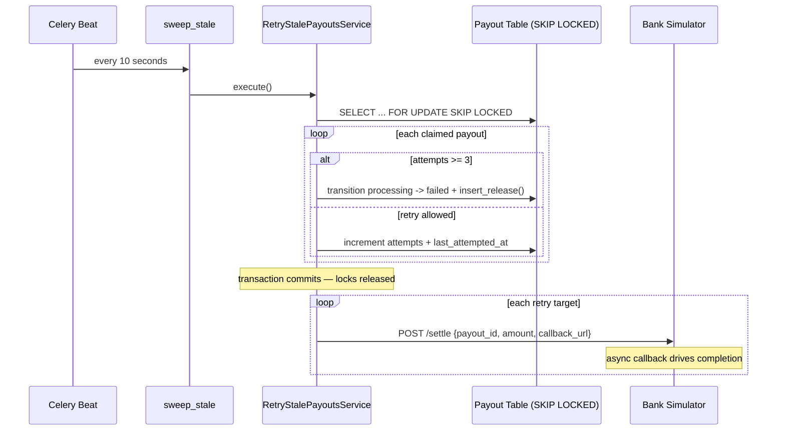
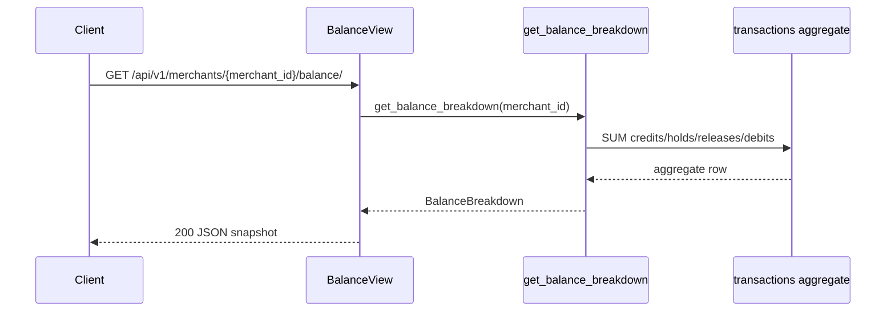

# 04-REQUEST_MONEY_AND_ASYNC_FLOWS

## Flow A: Create Payout
This flow turns an HTTP request into a reserved payout plus async work. The important design choice is that money reservation is synchronous, but settlement is not. Evidence: `backend/apps/payouts/api/views.py::PayoutCreateView.post`, `backend/apps/payouts/services/create_payout.py::CreatePayoutService._run_critical_path`.

### Step-by-Step
1. `PayoutCreateView.post()` requires `X-Merchant-Id` and `Idempotency-Key`, validates request body, and builds the service with raw body for canonical hashing. Evidence: `backend/apps/payouts/api/views.py::PayoutCreateView.post`, `backend/apps/payouts/api/serializers.py::CreatePayoutRequestSerializer`.
2. `CreatePayoutService.execute()` computes `expires_at`, inserts or fetches an idempotency record, and branches on whether the key is new. Evidence: `backend/apps/payouts/services/create_payout.py::CreatePayoutService.execute`, `backend/apps/payouts/repositories/idempotency_repo.py::insert_or_get_by_key`.
3. New-key execution enters `atomic()`, locks the merchant row with `select_for_update()`, checks active bank account ownership, derives current balance from the ledger, and rejects insufficient funds before any payout row is created. Evidence: `backend/apps/payouts/services/create_payout.py::CreatePayoutService._run_critical_path`, `backend/apps/payouts/repositories/merchant_repo.py::lock_for_update`, `backend/apps/payouts/repositories/merchant_repo.py::get_balance_breakdown`.
4. `payout_repo.create_with_hold()` creates a `pending` payout and immediately inserts the hold transaction. Evidence: `backend/apps/payouts/repositories/payout_repo.py::create_with_hold`, `backend/apps/payouts/repositories/transaction_repo.py::insert_hold`.
5. After the transaction exits, the service enqueues `payouts.process_payout` with optional correlation ID propagation and returns `201`. Evidence: `backend/apps/payouts/services/create_payout.py::CreatePayoutService._run_critical_path`, `backend/apps/payouts/tasks/payout_tasks.py::process_payout`.

### Rollback Points
- Serializer or header failure stops before service entry. Evidence: `backend/apps/payouts/api/views.py::PayoutCreateView.post`.
- Insufficient balance raises inside `execute()`, causing idempotency state to be updated with a stored `422` payload and no payout creation. Evidence: `backend/apps/payouts/services/create_payout.py::CreatePayoutService.execute`, `backend/apps/payouts/api/exceptions.py::custom_exception_handler`.
- Any exception inside the `atomic()` block rolls back both payout and hold creation. Evidence: Django transaction wrapper usage in `backend/apps/payouts/services/create_payout.py::CreatePayoutService._run_critical_path`.

### Race Prevention
- Merchant row lock serializes balance-check-plus-hold creation for the same merchant. Evidence: `backend/apps/payouts/repositories/merchant_repo.py::lock_for_update`, `backend/tests/integration/test_concurrency_tier1.py::test_concurrency_tier1`, `backend/tests/integration/test_concurrency_tier2.py::test_concurrency_tier2`.
- Unique `(merchant, idempotency_key)` prevents duplicate creation for repeated request keys. Evidence: `backend/apps/payouts/models.py::IdempotencyRecord.Meta`, `backend/tests/integration/test_db_constraints.py::test_idempotency_unique_key_constraint`.

### Failure Modes
- Bank account missing or inactive returns `404`. Evidence: `backend/apps/payouts/services/create_payout.py::CreatePayoutService._run_critical_path`, `backend/apps/payouts/api/exceptions.py::custom_exception_handler`.
- Same idempotency key with a different body returns `409`. Evidence: `backend/apps/payouts/services/create_payout.py::CreatePayoutService._handle_existing_record`.
- A completed DB commit followed by queue-enqueue failure would leave a `pending` payout with held funds until another process picks it up or an operator intervenes; there is no explicit outbox pattern here. Evidence: enqueue occurs after transaction in `backend/apps/payouts/services/create_payout.py::CreatePayoutService._run_critical_path`. Confidence: Medium.

## Flow B: Worker Processing
The worker claims a payout by guarded state transition, fires an HTTP request to the bank simulator, then returns. Outcome handling is entirely asynchronous — driven by the bank simulator's webhook callback. Evidence: `backend/apps/payouts/services/process_payout.py::ProcessPayoutService.execute`, `backend/apps/payouts/api/webhook.py::BankCallbackView`.

### Step-by-Step
1. The Celery task binds a correlation ID and instantiates `ProcessPayoutService`. Evidence: `backend/apps/payouts/tasks/payout_tasks.py::process_payout`.
2. The service loads the payout, short-circuits `not_found` or `already_handled`, then atomically transitions `pending → processing` with attempt increment. Evidence: `backend/apps/payouts/services/process_payout.py::ProcessPayoutService.execute`, `backend/apps/payouts/repositories/payout_repo.py::transition`.
3. `httpx.post()` fires to `BANK_SIMULATOR_URL/settle` with `payout_id`, `amount_paise`, and `callback_url`. On timeout or network error the exception is swallowed — the payout stays in PROCESSING for the sweeper. Evidence: `backend/apps/payouts/services/process_payout.py::ProcessPayoutService.execute`.
4. The bank simulator responds immediately (200) then fires a `POST /api/v1/webhooks/bank-callback` callback after 100–400ms. For the 10% "pending" outcome no callback is sent — the sweeper handles retry. Evidence: `bank_simulator/app.py`.
5. `BankCallbackView` receives the callback, looks up the payout, and calls `payout_repo.transition()` with the appropriate `on_apply` ledger operation inside `db_transaction.atomic()`. Re-delivery on a terminal payout is a no-op (200). Evidence: `backend/apps/payouts/api/webhook.py::BankCallbackView.post`.

### Rollback Points
- Webhook transitions run in `atomic()` blocks: status flip and ledger insert succeed or fail together. Evidence: `backend/apps/payouts/api/webhook.py::BankCallbackView.post`, `backend/apps/payouts/repositories/payout_repo.py::transition`.

### Race Prevention
- Conditional `update(... where status=frm)` means only one caller can move `pending → processing` or `processing → completed/failed`. Evidence: `backend/apps/payouts/repositories/payout_repo.py::transition`.
- Duplicate worker execution finds payout in PROCESSING, returns `already_handled` immediately. Evidence: `backend/apps/payouts/services/process_payout.py::ProcessPayoutService.execute`.
- Duplicate webhook delivery on a terminal payout returns 200 without calling `payout_repo.transition()`, so no double ledger entry is possible. Evidence: `backend/apps/payouts/api/webhook.py::BankCallbackView.post`.

### Failure Modes
- "Pending" outcome (no callback) leaves payout in PROCESSING; sweeper re-fires the HTTP call. Evidence: `bank_simulator/app.py`, `backend/apps/payouts/services/retry_stale.py`.

## Flow C: Retry Stale
The stale sweeper scans `processing` payouts older than a threshold, claims rows with `FOR UPDATE SKIP LOCKED`, bumps attempt counts inside the transaction, then fires HTTP calls to the bank simulator after the transaction commits. Evidence: `backend/apps/payouts/repositories/payout_repo.py::claim_stale_with_skip_locked`, `backend/apps/payouts/services/retry_stale.py::RetryStalePayoutsService.execute`.

### Step-by-Step
1. Beat schedules `payouts.sweep_stale` every 10 seconds. Evidence: `backend/config/settings/base.py::CELERY_BEAT_SCHEDULE`, `backend/apps/payouts/tasks/sweep_stale.py::sweep_stale`.
2. `claim_stale_with_skip_locked()` selects and locks `processing` rows older than threshold. Evidence: `backend/apps/payouts/repositories/payout_repo.py::claim_stale_with_skip_locked`.
3. For `attempts >= MAX_ATTEMPTS` (3): atomically transitions to FAILED + inserts release inside the transaction. No HTTP call. Evidence: `backend/apps/payouts/services/retry_stale.py::RetryStalePayoutsService._handle_stale_db`.
4. Otherwise: bumps `attempts` + `last_attempted_at` inside the transaction; collects `(payout_id, amount_paise)` for later. Transaction commits and locks release. Evidence: `backend/apps/payouts/services/retry_stale.py::RetryStalePayoutsService._handle_stale_db`.
5. After the transaction, fires `httpx.post()` to `BANK_SIMULATOR_URL/settle` for each retry target. The bank simulator's async callback will drive the state transition. Evidence: `backend/apps/payouts/services/retry_stale.py::RetryStalePayoutsService._fire_retry_http`.

### Race Prevention
- `FOR UPDATE SKIP LOCKED` prevents two sweeper instances from claiming the same stale payout. Evidence: `backend/apps/payouts/repositories/payout_repo.py::claim_stale_with_skip_locked`.
- HTTP calls happen outside the transaction so PostgreSQL row locks are not held during network I/O. Evidence: `backend/apps/payouts/services/retry_stale.py::RetryStalePayoutsService.execute`.

### Failure Modes
- Attempt increment uses direct ORM update; only terminal transitions generate payout events. Evidence: `backend/apps/payouts/services/retry_stale.py::RetryStalePayoutsService._handle_stale_db`.
- A payout receiving no callbacks across multiple sweeper cycles will increment `attempts` on each cycle until it hits MAX_ATTEMPTS and is forced to FAILED + release. Evidence: `backend/tests/integration/test_worker_hang_retry_max.py`.

## Flow D: Balance Read
Balance reads are snapshot aggregations, not materialized counters. Evidence: `backend/apps/payouts/api/views.py::BalanceView`, `backend/apps/payouts/repositories/merchant_repo.py::get_balance_breakdown`.

### Step-by-Step
1. `BalanceView.get()` delegates entirely to `get_balance_breakdown()`. Evidence: `backend/apps/payouts/api/views.py::BalanceView.get`.
2. The repository performs one aggregate query over `Transaction` by merchant and computes available and held fields from the results. Evidence: `backend/apps/payouts/repositories/merchant_repo.py::get_balance_breakdown`.
3. A merchant with no transactions returns zeroes rather than nulls. Evidence: `backend/tests/integration/test_balance_api.py::test_balance_zero_new_merchant`.

### Failure Modes
- If transaction rows are inconsistent with payout state, the balance endpoint will still report mathematically correct ledger math, not business-correct payout reality. That is why reconciliation exists separately. Evidence: `backend/apps/payouts/repositories/merchant_repo.py::get_balance_breakdown`, `backend/apps/payouts/services/reconcile_ledger.py::ReconcileLedgerService`.

## Known Unknowns
- There is no explicit outbox or post-commit hook wrapper for Celery enqueue, so exact behavior under broker outage between commit and `apply_async()` is not directly proven by tests. Evidence: `backend/apps/payouts/services/create_payout.py::CreatePayoutService._run_critical_path`; no dedicated failure test found. Confidence: Medium.
- The bank simulator webhook is not HMAC-signed. Any process that can reach `POST /api/v1/webhooks/bank-callback` can forge a callback. In production the provider shares a secret and the engine verifies `HMAC-SHA256(body, secret) == X-Signature`. Intentionally omitted here — focus is ledger correctness under async events. Confidence: High.
- The sweeper SQL filters on `last_attempted_at < now() - threshold`; payouts stuck in `processing` with null `last_attempted_at` are not explicitly described by tests. In normal code paths `processing` is entered with `last_attempted_at` set, but a manual DB edit could violate that assumption. Evidence: `backend/apps/payouts/repositories/payout_repo.py::claim_stale_with_skip_locked`, `backend/apps/payouts/repositories/payout_repo.py::transition`. Confidence: Medium.
